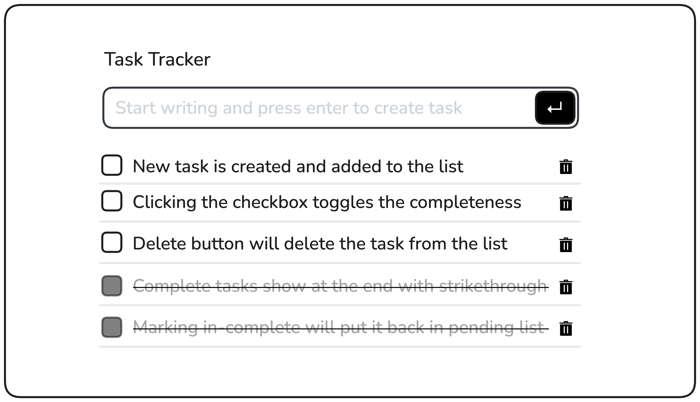

Here's your `README.md` file:  

```markdown
# Task Manager App

A simple **Task Manager** built with **JavaScript** and **Tailwind CSS**.  
It allows users to add, delete, and reorder tasks dynamically.  

## 🚀 Features
- Add tasks via **button click** or **Enter key**.
- Delete tasks instantly.
- Toggle task priority using **QT Button**:
  - Moves the task to the **end** when activated.
  - Moves the task to the **top** when deactivated.
- Responsive and styled with **Tailwind CSS**.

## 🛠️ Technologies Used
- **HTML**
- **JavaScript**
- **Tailwind CSS**

## 📜 Usage
1. Enter a task in the input field.
2. Press **Enter** or click the **Add Button**.
3. Click the **Delete Button** to remove a task.
4. Click the **QT Button** to reorder the task.

## 🎨 Tailwind CSS Setup
Make sure you have **Tailwind CSS** linked in your project:
```html
<link href="https://cdn.jsdelivr.net/npm/tailwindcss@2.2.19/dist/tailwind.min.css" rel="stylesheet">
```

## 📚 Learn More  
For more guidance on building a Task Tracker, check out this roadmap:  
[Task Tracker JavaScript Roadmap](https://roadmap.sh/projects/task-tracker-js)


## 📷 Screenshot


## 📌 Future Enhancements
- Add **local storage** support to persist tasks.
- Implement **drag & drop** for reordering.
- Add a **dark mode** toggle.

## 📝 License
This project is open-source and free to use.
```

### Next Steps:
- Add a screenshot (`screenshot.png`) to your project folder.
- Replace **Tailwind CDN** if you're using a different setup.

Let me know if you need any changes! 🚀🔥